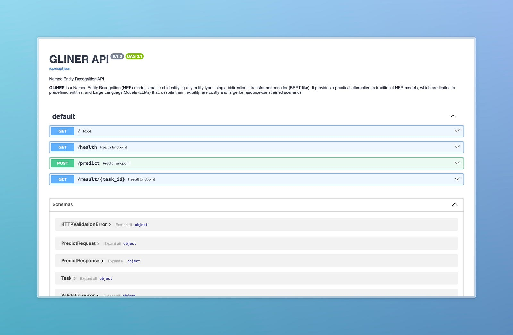
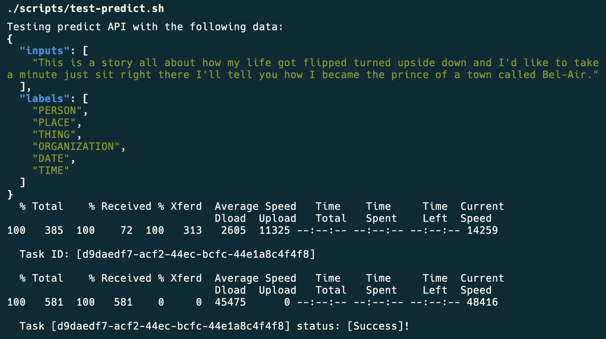
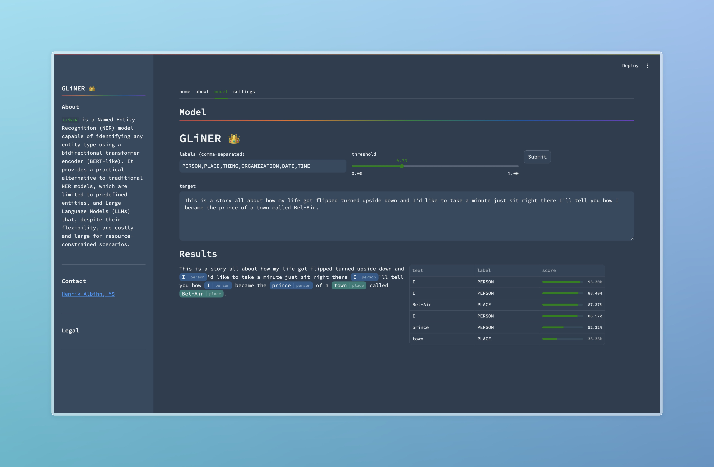

# `gliner-as-a-service`

Scalable [GLiNER](https://github.com/urchade/GLiNER) as a Service API.

[![LinkedIn][linkedin-shield]][linkedin-url]

## About

This project leverages FastAPI, Celery, and Redis to create a scalable and efficient system for generating and serving named entity predictions from text data. The architecture is designed to handle high volumes of requests with optimal performance and reliability.

- FastAPI is used as the high-performance web framework, providing fast and asynchronous endpoints to receive text data and return predictions.
- Celery manages the asynchronous task execution, distributing the workload across multiple workers, ensuring that the system can handle large-scale processing demands.
- Redis serves a dual role: as a message broker between FastAPI and Celery, and as a caching layer to store task results for quick retrieval.
- Flower is integrated for real-time monitoring and management of Celery tasks, giving you visibility into the system's performance and task execution status.
- Locust is integrated for load testing the API.

### Built With

- [GLiNER](https://github.com/urchade/GLiNER)
- [FastAPI](https://fastapi.tiangolo.com/)
- [Celery](https://docs.celeryq.dev/en/stable/index.html#)
- [Redis](https://redis.io/)
- [Flower](https://flower.readthedocs.io/en/latest/)
- [Locust](https://locust.io/)
- [Streamlit](https://streamlit.io/)

## Getting Started

The application is build with docker-compose to create the various microservices. These include the FastAPI application itself, the Redis database and the Celery application. To build the Dockerfile for both FastAPI and Celery, use the following command:

```bash
# Copy the .env.example file to .env
cp .env.example .env

# Build the Docker images
docker build . -f Dockerfile.torch-cpu --pull -t torch-cpu:latest
docker build . -f Dockerfile.gliner -t gliner-service:latest

# Start the containers in detached mode
docker compose up -d
```

The following environment variables  needed in a ```.env``` file.
Leave as is for local testing.

```bash
REDIS_URL=redis://redis:6379/0
```

Open the browsers to see FastAPI's SwaggerUI, Locust, and Flower UI:

```bash
python scripts/open_browsers.py
```



Finally you can test the model:

```bash
./scripts/test-predict.sh
```



```json
[
  [
    {
      "start": 73,
      "end": 74,
      "text": "I",
      "label": "PERSON",
      "score": 0.932999312877655
    },
    {
      "start": 120,
      "end": 121,
      "text": "I",
      "label": "PERSON",
      "score": 0.865664541721344
    },
    {
      "start": 138,
      "end": 139,
      "text": "I",
      "label": "PERSON",
      "score": 0.8840217590332031
    },
    {
      "start": 151,
      "end": 157,
      "text": "prince",
      "label": "PERSON",
      "score": 0.5222376585006714
    },
    {
      "start": 163,
      "end": 167,
      "text": "town",
      "label": "PLACE",
      "score": 0.35346755385398865
    },
    {
      "start": 175,
      "end": 182,
      "text": "Bel-Air",
      "label": "PLACE",
      "score": 0.8736599087715149
    }
  ]
]
```

## User Interface

The UI is built with [Streamlit](https://streamlit.io/) and can be run with the following command:

```bash
./scripts/start-ui.sh
```



*Note: The UI is an independent client (and thus has extra dependencies). It is not required to run the API.*

[linkedin-shield]: https://img.shields.io/badge/-LinkedIn-white.svg?
[linkedin-url]: https://linkedin.com/in/henrikalbihn
